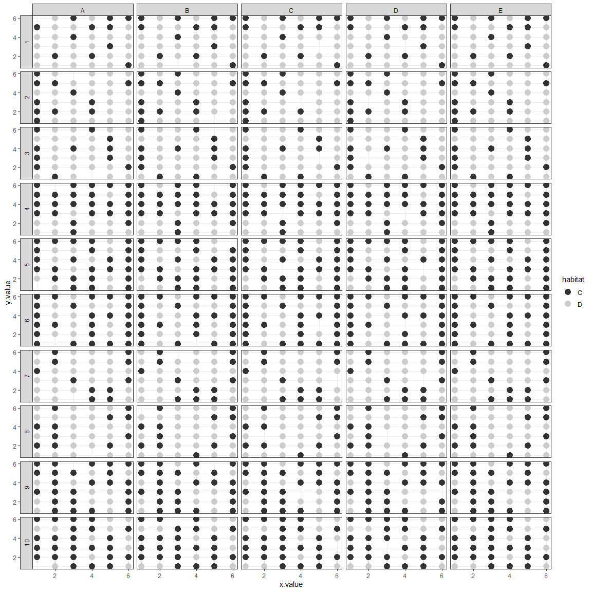

Exploring Resetarits\&al2018FinalData.txt
================

This is the final data file that was given to me by Emlyn, but there is
no metadata associated to any of the files provided, thus trying here to
have a clear picture of how they are organized and the kind of data they
have.

``` r
library(dplyr)
library(ggplot2)
```

``` r
resetarits_data <- read.table(here::here("nov_2019", "Resetarits&al2018FinalData.txt"))
head(resetarits_data)
```

    ##      date landscape meta type sample x.value y.value habitat habitat.bi age
    ## 1 4/20/15         1    1    E      1       1       6       C          0  11
    ## 2 4/20/15         1    1    E      2       1       5       C          0  11
    ## 3 4/20/15         1    1    E      3       1       4       D          1   4
    ## 4 4/20/15         1    1    E      4       1       3       D          1   1
    ## 5 4/20/15         1    1    E      5       1       2       D          1  11
    ## 6 4/20/15         1    1    E      6       1       1       D          1   7
    ##   volume euplotes paramecium blepharisma colpidium rotifer vorticella
    ## 1      1        0          0           0         0      16        152
    ## 2      1        0         26           0         0      26         94
    ## 3      1       92        368          68      1276       0         10
    ## 4      1        2          8          14       834       2         21
    ## 5      1        2          2         184         0      28          4
    ## 6      1        2          0         284         4       2         16
    ##   chilomonas counter eu_density para_density bleph_density colp_density
    ## 1          0     EJR          0            0             0            0
    ## 2          0     EJR          0           26             0            0
    ## 3        100     EJR         92          368            68         1276
    ## 4      10000     EJR          2            8            14          834
    ## 5          0     EJR          2            2           184            0
    ## 6          0     EJR          2            0           284            4
    ##   rot_density vort_density chilo_density
    ## 1          16          152             0
    ## 2          26           94             0
    ## 3           0           10           100
    ## 4           2           21         10000
    ## 5          28            4             0
    ## 6           2           16             0

``` r
names(resetarits_data)
```

    ##  [1] "date"          "landscape"     "meta"          "type"         
    ##  [5] "sample"        "x.value"       "y.value"       "habitat"      
    ##  [9] "habitat.bi"    "age"           "volume"        "euplotes"     
    ## [13] "paramecium"    "blepharisma"   "colpidium"     "rotifer"      
    ## [17] "vorticella"    "chilomonas"    "counter"       "eu_density"   
    ## [21] "para_density"  "bleph_density" "colp_density"  "rot_density"  
    ## [25] "vort_density"  "chilo_density"

  - date: when the samples were counted
  - landscape: this is the type of arrangement of habitat types in the 6
    by 6 setup. Where landscapes 1,2,3, 7, and 8 are one group sharing
    the “common” patches. The others share the other “common”
  - meta: metacommunity. There are 5 metacommunities per landscape, one
    control and four removal treatments
  - type: the type of removal happening. Type E is the control (no
    removals), A and B are low connectivity, C and D are high
    connectivity removals.
  - sample: each individual “patch” within the metacommunity. With
    control metacommunities having 36 samples, and treatment
    metacommunities having 35
  - x.value/y.value: location of the sample in the 36 by 36 grid
  - habitat: dominating habitat, whether it is algal production or
    bacterial decomposition of organic matter. Algal patches innoculated
    with Chlamydomonas (so I’m guessing coded as C?), and bacterial
    patches had degraded wheat (D?)
  - age: time since disturbance

<!-- end list -->

``` r
resetarits_data %>% 
  ggplot(., aes(x = x.value, y = y.value, color = habitat)) +
  facet_grid(landscape~type, switch = "y")+
  geom_point(size = 4) +
  scale_colour_grey() +
  theme_bw()
```

<!-- -->

The variables with `_density` are the ones we need to use for hmsc. They
have very similar values to the others, which I am guessing is just raw
abundance. However, the volume does change for a few of them, so density
is the way to go here.

*Now, check the PCNMs that Emlyn had run before. She has no code
associated to how she got them, or it was outdated with deprecated
functions. So, I’m exploring the data but eventually will have to run
our own.*
